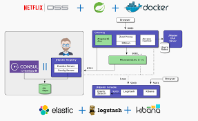
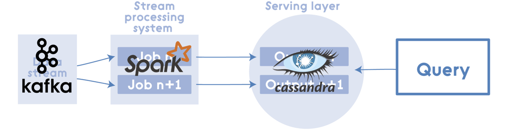
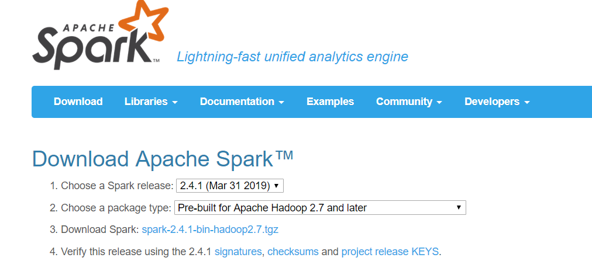
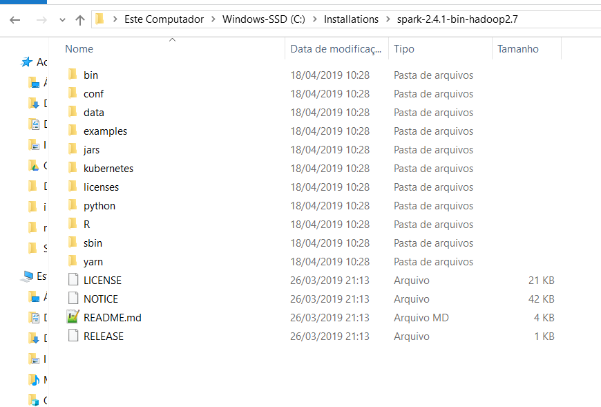
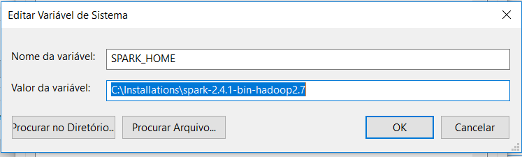
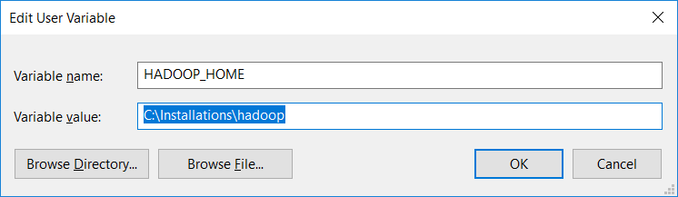
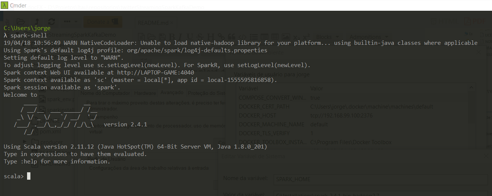

# Twitter Streaming Analyze usando Java 8, Spark Streaming, Kafka e Cassandra


Um projeto de demonstração usando Spark Streaming para analisar hashtags populares do Twitter.
Os dados vêm da fonte da Twitter Streaming API e são fornecidos ao Kafka.
O consumidor com.twitter.producer.service recebe dados do Kafka e, em seguida, os processa em um fluxo usando o Spark Streaming.


# Introdução

Utilizamos neste projeto docker que tem como finalidade, abstrair todo processo de infraestrura para nossa aplicação funcionar. Implementamos o kafka, zookeeper e Cassandra. Entretanto esta documentação não entrará em detalhes em como instalar o docker em sua máquina de desenvolvimento.

## Estrutura do Projeto

Nossa projeto e baseado em uma estrutura de projeto multi-módulos

 1)  shangrila-producer - Realiza a consulta a api do Twitter e funciona como produtor de topico no Kafka

 2)  shangrila-consumer - Tem a responsabilidade de implementar as regras de negocio atraves do spark streaming e salvar no Banco de Dados (Cassandra). Também tem a responsabilidade de ser o consumidor dos topicos do Kafka.
 
 3)  shangrila-dashboard - Tem a responsabilidade de sumarizar a visualização das regras de negocio implementadas. Lê as informações da base de Dados do Cassandra e envia informações para o frontend via WebSocket.


# Desenho da Arquitetura da Solução
Neste projeto foi utilizada a arquitetura baseada em microserviços utilizando os fundamentos dos serviços RestFul. Implementando esses recursos com vários recursos - controle de versão, tratamento de exceções, documentação (Swagger), autenticação básica (Spring Security), filtragem e HATEOAS. Procurando sem utilizar as melhores práticas na criação de serviços da Web RESTful.



O desenho e implementação de uma arquitetura distribuída, que realize a integração com o Twitter que seja tolerante a falhas e escalável horizontalmente, que exponha através de uma aplicação web as informações sumarizadas e descritas no Case de integração.





## Ferramentas Utilizadas

* Apache Maven 3.x
* JVM 8
* Docker machine
* DevCenter
* Eclipse & Embedded Maven
- PostMan
- Git Client - https://git-scm.com/
* Registratar um aplicativo no Twtter.
* Em seguida, processa em um fluxo usando Sparj Streaming: [Como criar uma aplicação no Twitter.](http://docs.inboundnow.com/guide/create-twitter-application/).

Na próxima etapa irei demonstrar como configurar o ambiente para que executar nossa aplicação. 


## Guia de início Raṕido

Neste quie rápido mostrarei como configurar sua máquina para executar nosso aplicativo.

### Apache Spark no Windows

* Faça o download do Spark em  https://spark.apache.org/downloads.html  

1. Descompacte o arquivo spark-2.4.1-bin-hadoop2.7.tgz em um diretório.


2. Agora defina variáveis de ambiente SPARK_HOME = C:\Installations \spark-2.4.1-bin-hadoop2.7



```
~>  SPARK_HOME = C:\Installations \spark-2.4.1-bin-hadoop2.7
```

* Instalando o binário winutils


1. Faça o download do [winutils.exe](https://github.com/steveloughran/winutils/raw/master/hadoop-2.7.1/bin/winutils.exe) do Hadoop 2.7 e coloque-o em um diretório C: \ Installations \ Hadoop \ bin


2. Agora defina variáveis de ambiente HADOOP_HOME = C: \ Installations \ Hadoop.



```
~>  HADOOP_HOME = C:\Installations\Hadoop
```

Agora inicie o shell do Windows você pode receber alguns avisos, que você pode ignorar por enquanto.




 
1. Mude a configuração do Twitter no arquivo `\producer\src\main\resources\application.yml`colocando suas credencias do Twtter, client Id e Secret Id.

2. Execute a imagem kafka usando o docker-compose (lembre-se de que a imagem kafka também precisa extrair o zookeper):

```
~>  docker-compose -f shangrila-producer/src/main/docker/kafka-docker-compose.yml up -d   
```
Execute a imagem do Cassandra usando o docker-compose.

```
~>  docker-compose -f shangrila-consumer\src\main\docker\cassandra.yml up -d   
```

Verifique se o Cassandra, ZooKeeper e o Kafka estão em execução (no prompt de comando)


```
~> docker ps 
```

A execução correta dos comandos deve gerar como resposta semelhante a imagem a baixo:


6. Execute o poducer e o aplicativo do consumidor com:

```
~> mvn spring-boot:run
```

## Criação das tabelas no Casssandra

Primeiro precisamos criar o Keyspace

```
//Create keyspace
CREATE KEYSPACE IF NOT EXISTS TrafficKeySpace
WITH replication = {
	'class' : 'SimpleStrategy',
	'replication_factor' : 1
};
```

Criação das tabelas

```
//Create table
CREATE TABLE TrafficKeySpace.tweet_playload (
	name text,
	mensagem text,
	seguidores bigint,
	datatweet timestamp,
	idioma text,
	PRIMARY KEY (name)
);

CREATE TABLE TrafficKeySpace.Window_Tweet_Traffic (
	routeId text,
	totalCount bigint,
	timeStamp timestamp,
	recordDate text,
	PRIMARY KEY (routeId, recordDate)
);

CREATE TABLE TrafficKeySpace.TweetsUsuario_Trafic (
	name text,
	mensagem text,
	idioma text,
	totalCount bigint,
	timeStamp timestamp,
	recordDate text,
	PRIMARY KEY (name, mensagem, idioma, recordDate)
);

CREATE TABLE TrafficKeySpace.TweetsFollwers_Trafic (
	name text,
	totalCount bigint,
	timeStamp timestamp,
	recordDate text,
	PRIMARY KEY (name, recordDate)
);
```

## Esta documentação esta em desenvolvimento

## Referências
* [Instalação do Apache Spark Windows](https://dzone.com/articles/working-on-apache-spark-on-windows)
* [Spring for Apache Kafka](https://projects.spring.io/spring-kafka/)
* [Spring Social Twitter](http://projects.spring.io/spring-social-twitter/)
* [Spark Overview](http://spark.apache.org/docs/latest/)
* [Apache Kafka Documentation](http://kafka.apache.org/documentation.html)
* [Big Data Processing with Apache Spark - Part 3: Spark Streaming](https://www.infoq.com/articles/apache-spark-streaming)
* [Spring Kafka - Embedded Unit Test Example](https://www.codenotfound.com/spring-kafka-embedded-unit-test-example.html)
* https://github.com/FoxtrotSystems
* https://docs.datastax.com/en/developer/devcenter/doc/devcenter/dcInstallation.html
